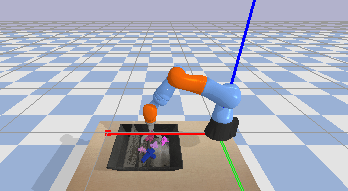

## Mastering Robotic Arm Manipulation with Deep Reinforcement Learning

Robotic manipulation has captured the interest of many in the machine learning community. This project aims to apply reinforcement learning (RL) algorithms for this task using the PyBullet physics engine. The primary focus is to train a robotic arm to perform pick-and-place operations in simulated environments. The performance of Advantage Actor Critic (A2C), Deep-Q-Networks (DQN), Proximal Policy Optimization (PPO), and Soft Actor Critic (SAC) will be evaluated and compared, analyzing their effectiveness in terms of sample efficiency, stability, and task completion rates. Performance metrics such as learning speed, success rate, and policy stability will be used to compare the algorithms’ effectiveness.

The Kuka environment in PyBullet simulates a robotic arm to grasp objects. The agent can choose from 7 actions – move in x-direction (+/-), y-direction (+/-), adjust vertical angle (up/down), or do nothing. Velocity for each direction is equal. A ‘height hack’ is leveraged, where the gripper automatically moves down for each action. As part of the reward structure, the agent receives a reward of +1 if an object is lifted above a height of 0.2 at the end of the episode. Lastly, the environment provides (48, 48, 3) RGB images as input, making way for convolutional neural networks (CNNs) to decode an optimal policy through purely visual input.

Source: https://github.com/mahyaret/kuka_rl/tree/master

### Research Plan

So far, the team has completed applying A2C, DQN, PPO, and SAC to the Kuka environment. The authors contributed equally, conducting a thorough literature review and implementing each of the four algorithms. Over this next month, the authors will develop performance metrics (e.g., sample efficiency, learning speed, task completion rate, and policy stability) and define an evaluation framework to draw conclusions regarding the strengths and weaknesses of each algorithm. This framework design would comprise a standardized testing protocol for all algorithms, a scoring system to quantify algorithm performance across metrics, and templates for result reporting and visualization.

In the upcoming months, the team will conduct extensive experiments, including ablation studies to isolate the impact of key components in each algorithm. For instance, they will examine the effect of experience replay (presence and size) in DQN, the importance of the entropy term in SAC, the influence of the clipping parameter in PPO, and the impact of n-step returns in A2C. They will also vary initial conditions such as object shapes (cubes, spheres, cylinders), sizes (small, medium, large), and positions (centered, off-center, elevated) to test the algorithms' generalization capabilities across multiple scenarios.

To assess robustness, the team will introduce controlled perturbations during task execution, such as simulated sensor noise or unexpected object movements to better assess how these models react in real-world environments. They will also evaluate each algorithm's performance under different reward structures (sparse vs dense, shaped vs unshaped) to understand their sensitivity to alternative reward schemes.

In order to capture such information, data processing scripts will be created to efficiently analyze the collected information, including statistical tests (e.g., t-tests, ANOVA) to determine the significance of performance differences. The team will develop informative visualizations, such as learning curves, performance heatmaps across different object types, and radar charts comparing multi-dimensional metrics across algorithms.

The team anticipates highlighting several key insights:

* The trade-off between sample efficiency and final performance across algorithms,
* Each algorithm's ability to generalize across different object types and initial conditions,
* The impact of continuous vs. discrete action spaces on performance in the Kuka environment,
* The stability of learned policies, particularly in the face of perturbations,
* The computational requirements and training time for each algorithm.

In late November, the team will present these insights and submit a final report encompassing the project's methodology, results, and conclusions. The report will include a detailed comparison of the algorithms, highlighting scenarios where each excels or struggles. Additionally, it will offer suggestions for future research directions, such as combining strengths of different algorithms or adapting them specifically for robotic arm control tasks.

### Sub Folders

The `code` folder comprises 4 sub-folders: `ppo`, `a2c`, `sac`, and `dqn`. This is where each of the algorithmic implementations are. Descriptions of each algorithm have been included within this folder as well.

### Resources

- [Repo Inspo](https://github.com/mahyaret/kuka_rl/tree/master)
- [A2C/A3C Paper](https://arxiv.org/abs/1602.01783)
- [DQN Paper](https://arxiv.org/abs/1312.5602)
- [SAC Paper](https://arxiv.org/abs/1801.01290)
- [PPO Paper](https://arxiv.org/abs/1707.06347)
- [PyBullet Documentation](https://docs.google.com/document/d/10sXEhzFRSnvFcl3XxNGhnD4N2SedqwdAvK3dsihxVUA/edit#heading=h.2ye70wns7io3)
- [Stable Baselines3 Documentation](https://stable-baselines3.readthedocs.io/en/master/)
- [OpenAI Gym Documentation](https://www.gymlibrary.dev/)
